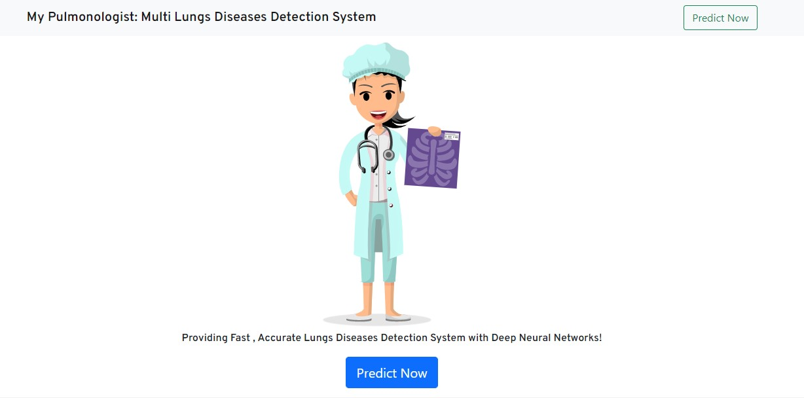

 

  

  <h3 align="center">My Pulmonologist</h3>

  

    Providing Fast , Accurate Lungs Diseases Detection System with Deep Neural Networ
     
     
    <a href="https://github.com/PatelNupur/MyPulmonologist"><strong>Explore the docs »</strong></a>
     
     
       .
    <a href="https://github.com/PatelNupur/MyPulmonologist">Report Bug</a>
    .
    <a href="https://github.com/PatelNupur/MyPulmonologist">Request Feature</a>
  

## Table Of Contents

* [About the Project](#about-the-project)
* [Built With](#built-with)
* [Getting Started](#getting-started)
  * [Installation](#installation)
* [Usage](#usage)
* [Contributing](#contributing)
* [License](#license)
* [Authors](#authors)

## About The Project

This project is about the classification of different lung diseases like COVID, Pneumonia, Tuberculosis, and Lung Cancer using chest-Xrays and CT scan images.

## Dataset
Dataset Used:
1. https://www.kaggle.com/paultimothymooney/chest-xray-pneumonia
2. https://www.kaggle.com/prashant268/chest-xray-covid19-pneumonia
3. https://www.kaggle.com/jtiptj/chest-xray-pneumoniacovid19tuberculosis
4. https://www.kaggle.com/tolgadincer/labeled-chest-xray-images
5. https://www.kaggle.com/hamdallak/the-iqothnccd-lung-cancer-dataset

## Built With

To build this project I followed the below approach.

Step 1:

Data Preprocessing: In data preprocessing I had used different image processing techniques like noise removing, contrast adjusting using CLAHE, etc to enhance the image quality.

Step 2:

Training: To train I had used different transfer learning models like resnet52,vgg19,vgg16,inception,exception,mobilenet,inceptionresnet, etc. I had done fine-tuning on different models to increase the accuracy. After I had done the ensembling of different model as every models have their own methods to extract the feature from images.

Step 3:

Deployment: For deployment, I had used flask and AWS

## Getting Started

### Installation

To run this application in your local system do the following steps
1. Download zip file in your local system
2. Open Command prompt
3. Run python app.py

## Usage

To use this application you need to take an X-ray/Ct scan image in JPEG/PNG/JPG format then insert it into our application you will get a result whether you have which diseases or you are normal.

